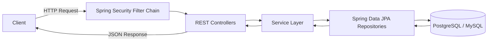

# RoleRadar


> **Enterprise-oriented backend infrastructure built with Java, Spring Boot, and PostgreSQL.**

## Backend platform for managing and mapping modern Software Engineering and SDLC roles

RoleRadar is a Java Spring Boot backend platform designed to demonstrate modern backend engineering practices through secure REST APIs, layered architecture, relational database modeling, and maintainable software design.

The project is being developed incrementally with a strong focus on clean architecture, security, scalability, and production-inspired engineering practices.

---

## Why RoleRadar?

RoleRadar is designed as more than a CRUD application.

Its purpose is to demonstrate how enterprise backend systems are structured using the Spring ecosystem while following software engineering best practices such as separation of concerns, layered architecture, repository abstraction, and incremental feature development.

---

## Table of Contents

* [Project Status](#project-status)
* [Technology Stack](#technology-stack)
* [Design Principles](#design-principles)
* [System Architecture](#system-architecture)
* [Request Flow](#request-flow)
* [Core Engineering Features](#core-engineering-features)
* [Project Structure](#project-structure)
* [Getting Started](#getting-started)
* [Development Workflow](#development-workflow)
* [Roadmap](#roadmap)
* [API Documentation](#api-documentation)
* [License](#license)

---

## Project Status

🚧 **Active Development**

### Current Progress

* ✅ User Registration API
* ✅ Layered Architecture
* ✅ Spring Data JPA
* ✅ PostgreSQL Integration
* 🔄 JWT Authentication (In Progress)

---

## Technology Stack

| Category        | Technology                  |
| --------------- | --------------------------- |
| Language        | Java 17                     |
| Framework       | Spring Boot                 |
| Security        | Spring Security             |
| Persistence     | Spring Data JPA + Hibernate |
| Database        | PostgreSQL / MySQL          |
| Build Tool      | Apache Maven                |
| Version Control | Git                         |

---

## Design Principles

* Separation of Concerns
* Layered Architecture
* Clean API Design
* Secure by Default
* Maintainable Code
* Incremental Development

---

## System Architecture

RoleRadar follows a layered architecture where every component has a single responsibility.

### Controller Layer

* Handles HTTP requests and responses
* Validates incoming requests
* Delegates business operations

### Service Layer

* Contains business logic
* Coordinates application workflows
* Enforces domain rules

### Repository Layer

* Built using Spring Data JPA
* Encapsulates persistence logic
* Interacts with Hibernate

### Database Layer

* Supports PostgreSQL and MySQL
* Uses normalized relational models
* Optimized for maintainability and scalability

---

## Request Flow



---

## Core Engineering Features

### Implemented Features

* RESTful API development
* Layered architecture
* Spring Data JPA integration
* Hibernate ORM
* Relational database persistence
* Maven dependency management
* Git-based version control

---

### Planned Features

#### Authentication & Authorization

* JWT Authentication
* Stateless Security
* Role-Based Access Control (RBAC)

#### API Design

* DTO encapsulation
* Request validation
* Standardized API responses

#### Error Handling

* Global exception handling using `@ControllerAdvice`
* Custom exception responses
* Payload validation using `jakarta.validation`

#### Database Optimization

* Optimized entity relationships
* Efficient join strategies
* Lazy loading where appropriate
* Repository abstraction
* Elimination of N+1 query bottlenecks

---

## Project Structure

```text
src
└── main
    ├── java
    │   ├── controller
    │   ├── service
    │   ├── repository
    │   ├── entity
    │   ├── dto
    │   ├── security
    │   ├── exception
    │   └── config
    │
    └── resources
        ├── application.properties
        └── static
```

---

## Project Structure Philosophy

The project follows a layered architecture where each package has a clearly defined responsibility.

| Package      | Responsibility                   |
| ------------ | -------------------------------- |
| `controller` | HTTP request handling            |
| `service`    | Business logic                   |
| `repository` | Data access                      |
| `entity`     | Persistence models               |
| `dto`        | API request/response models      |
| `security`   | Authentication and authorization |
| `exception`  | Centralized error handling       |
| `config`     | Application configuration        |

---

## Getting Started

### Prerequisites

* Java 17+
* Apache Maven 3.8+
* PostgreSQL or MySQL
* Git

### Clone the Repository

```bash
git clone https://github.com/priyanshu-dube/RoleRadar.git

cd RoleRadar
```

### Configure

Update the database configuration in:

```text
src/main/resources/application.properties
```

Configure:

* Database URL
* Username
* Password

### Build

```bash
mvn clean package
```

### Run

```bash
java -jar target/RoleRadar-0.0.1-SNAPSHOT.jar
```

or

```bash
mvn spring-boot:run
```

---

## Development Workflow

RoleRadar follows an incremental feature-based Git workflow.

### Branch Strategy

* `main`
* `feature/authentication`
* `feature/user-registration`
* `feature/security`
* `fix/validation`

### Semantic Commits

```text
feat(auth): implement JWT authentication
feat(api): add user registration endpoint
fix(validation): improve request validation
refactor(service): simplify business logic
docs: update project documentation
```

---

## Roadmap

* [x] User Registration API
* [x] Layered Architecture
* [x] Spring Data JPA Integration
* [x] PostgreSQL Persistence
* [ ] JWT Authentication
* [ ] Role-Based Access Control (RBAC)
* [ ] DTO Layer
* [ ] Global Exception Handling
* [ ] Request Validation
* [ ] Swagger / OpenAPI
* [ ] Docker Support
* [ ] GitHub Actions CI
* [ ] Integration Testing
* [ ] Redis Caching
* [ ] Audit Logging
* [ ] Refresh Token Support

---

## API Documentation

Interactive API documentation using **OpenAPI / Swagger UI** will be added after the authentication module is completed.

---

## License

This project is maintained as a backend engineering portfolio project demonstrating enterprise-oriented Java and Spring Boot development practices.
