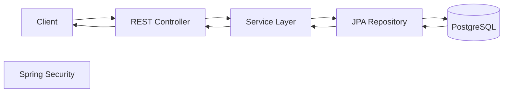

# 🚀 RoleRadar


> **Enterprise-inspired backend platform built with Java, Spring Boot, and PostgreSQL.**

RoleRadar is a backend engineering project focused on building a scalable, secure, and maintainable REST API using modern Java development practices. It demonstrates layered architecture, DTO pattern, request validation, exception handling, and database integration while following clean software engineering principles.

---

# 📌 Table of Contents

- [Project Status](#-project-status)
- [Technology Stack](#-technology-stack)
- [Key Features](#-key-features)
- [Architecture](#-architecture)
- [Project Structure](#-project-structure)
- [REST API Endpoints](#-rest-api-endpoints)
- [Getting Started](#-getting-started)
- [Development Workflow](#-development-workflow)
- [Roadmap](#-roadmap)
- [Future Improvements](#-future-improvements)
- [License](#-license)

---

# 🚧 Project Status

### Current Progress

- ✅ Complete User CRUD APIs
- ✅ Layered Architecture
- ✅ DTO Pattern
- ✅ Request Validation
- ✅ Global Exception Handling
- ✅ Custom Exceptions
- ✅ Spring Data JPA + Hibernate
- ✅ PostgreSQL Integration
- 🔄 JWT Authentication (Next Milestone)

---

# 🛠 Technology Stack

| Category | Technology |
|-----------|------------|
| Language | Java 21 |
| Framework | Spring Boot 4 |
| Security | Spring Security |
| ORM | Hibernate |
| Persistence | Spring Data JPA |
| Validation | Jakarta Bean Validation |
| Database | PostgreSQL |
| Build Tool | Maven |
| Version Control | Git & GitHub |

---

# ✨ Key Features

## ✅ Implemented

- RESTful CRUD APIs
- Layered Architecture
- DTO Pattern
- Entity ↔ DTO Mapping
- Request Validation
- Global Exception Handling
- Custom Exceptions
- Spring Data JPA
- Hibernate ORM
- PostgreSQL Integration
- Clean API Response Design
- Dependency Injection
- Maven Build Management

---

## 🚀 In Progress

- JWT Authentication
- Password Encryption (BCrypt)
- Role-Based Authorization
- Protected Endpoints

---

# 🏗 Architecture

RoleRadar follows a clean layered architecture where each layer has a single responsibility.

```text
Client
   │
   ▼
REST Controller
   │
   ▼
Service Layer
   │
   ▼
Repository Layer
   │
   ▼
PostgreSQL Database
```

---

# 🔄 Request Flow



---

# 📂 Project Structure

```text
src
└── main
    ├── java
    │
    ├── controller
    ├── service
    │    └── impl
    ├── repository
    ├── entity
    ├── dto
    ├── mapper
    ├── exception
    ├── security
    └── config
    │
    └── resources
         ├── application.properties
         └── static
```

---

# 🌐 REST API Endpoints

| Method | Endpoint | Description |
|----------|--------------------------|---------------------------|
| POST | `/api/users/register` | Register User |
| GET | `/api/users` | Get All Users |
| GET | `/api/users/{id}` | Get User By ID |
| PUT | `/api/users/{id}` | Update User |
| DELETE | `/api/users/{id}` | Delete User |

---

# 📚 Engineering Practices

- Layered Architecture
- Repository Pattern
- DTO Pattern
- Separation of Concerns
- Dependency Injection
- Bean Validation
- Exception Handling
- RESTful API Design
- Clean Code Principles
- Incremental Development

---

# 🚀 Getting Started

## Prerequisites

- Java 21+
- Maven
- PostgreSQL
- Git

---

## Clone Repository

```bash
git clone https://github.com/priyanshu-dube/RoleRadar.git

cd RoleRadar
```

---

## Configure Database

Update:

```text
src/main/resources/application.properties
```

Configure:

- Database URL
- Username
- Password

---

## Build

```bash
mvn clean install
```

---

## Run

```bash
mvn spring-boot:run
```

or

```bash
java -jar target/RoleRadar-0.0.1-SNAPSHOT.jar
```

---

# 🌱 Development Workflow

RoleRadar is being built incrementally using feature-based development.

Example commit messages:

```text
feat(user): implement CRUD APIs
feat(dto): introduce DTO mapping
feat(validation): add bean validation
feat(exception): implement global exception handling
feat(auth): add JWT authentication
```

---

# 🛣 Roadmap

## ✅ Completed

- [x] Layered Architecture
- [x] CRUD APIs
- [x] Spring Data JPA
- [x] Hibernate ORM
- [x] PostgreSQL Integration
- [x] DTO Pattern
- [x] Request Validation
- [x] Global Exception Handling
- [x] Custom Exceptions

---

## 🚧 Upcoming

- [ ] JWT Authentication
- [ ] BCrypt Password Encoding
- [ ] Login API
- [ ] Role-Based Access Control (RBAC)
- [ ] Swagger / OpenAPI Documentation
- [ ] Docker Support
- [ ] GitHub Actions CI/CD
- [ ] Unit & Integration Testing
- [ ] Redis Caching
- [ ] Audit Logging
- [ ] Refresh Token Authentication

---

# 🎯 Future Improvements

- Resume Parsing
- AI Skill Matching
- Job Recommendation Engine
- Elasticsearch Integration
- Email Notifications
- Admin Dashboard
- Microservices Migration
- Kubernetes Deployment

---

# 📈 Current Backend Progress

```
██████████░░░░░░░░░░ 50%
```

Completed

- Spring Boot Setup
- Database Integration
- CRUD APIs
- DTO Layer
- Validation
- Exception Handling

Next Milestone

🔐 JWT Authentication

---

# 📄 License

This project is developed as a backend engineering portfolio project to demonstrate enterprise-level Java, Spring Boot, and PostgreSQL development practices.

---

## ⭐ If you found this project interesting, consider giving it a star!

It helps support the project and motivates future development.
